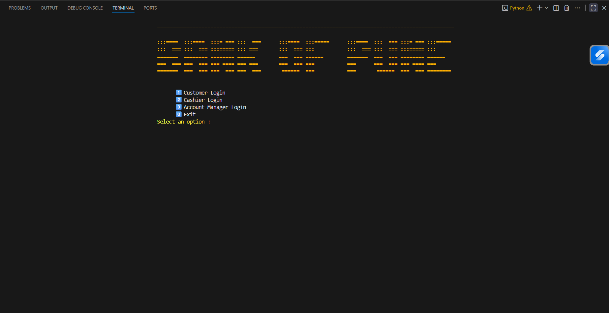
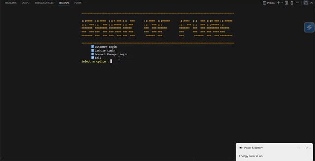
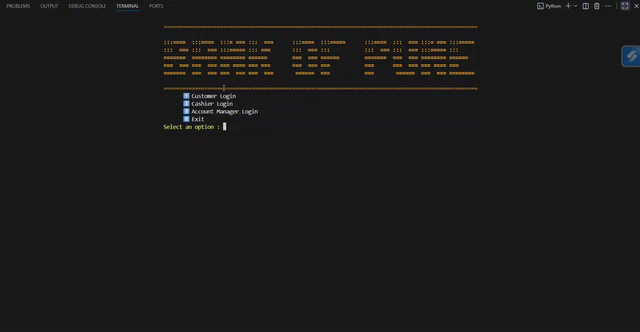
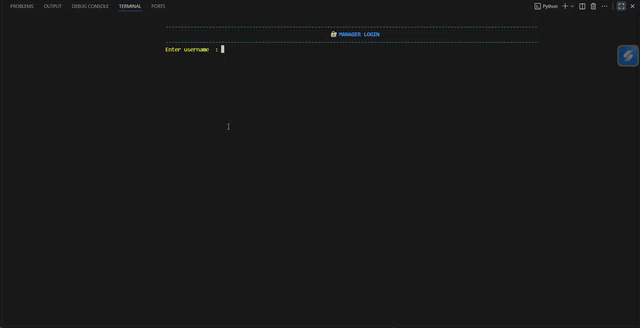

## 🏦 Banking Management System

### 🌐 Landing Page
Welcome to the **Banking Management System** — a digital platform built to simulate real-world banking operations with secure login and role-based access control.

  

---

## 👤 CUSTOMER MENU
**Role:** Customer — Manage your personal banking operations directly from your secure dashboard.

  

### 🧍 Key Features:
- **View Account Details** — See username, account number, balance, and more.
- **Transfer Money** — Secure fund transfers with instant reflection and validation.
- **View Transaction History** — Access timestamped transaction logs.
- **Receive Money via UPI** — Generate and share QR codes for instant payments.
- **Logout Safely** — End your session securely.

💡 *Tip:* Always verify recipient account numbers and maintain session security by logging out after each use.

---

## 💼 CASHIER MENU
**Role:** Cashier — Oversee deposits, withdrawals, and daily transaction verification.

  

### 🏦 Key Features:
- **Deposit Money** — Add funds to customer accounts with validation.
- **Withdraw Money** — Process verified withdrawals securely.
- **View All Transactions** — Access system-wide transaction logs.
- **Logout** — Terminate session safely.

💡 *Tip:* Always confirm account numbers and amounts before proceeding. Report suspicious or large transactions to the Account Manager.

---

## 🧾 ACCOUNT MANAGER MENU
**Role:** Account Manager — Manage customer profiles, monitor accounts, and ensure operational integrity.

  

### 🗂️ Key Features:
- **Create New Customer Account** — Register customers with full validation and encryption.
- **View All Customers** — Display registered users with secure data handling.
- **Delete Customer Account** — Remove accounts permanently with confirmation.
- **Logout** — End session securely.

💡 *Best Practices:*
- Always verify customer data before registration or deletion.
- Maintain confidentiality of all account information.
- Coordinate with system administrators for any discrepancies.

---

  <em>🔒 A secure, role-based banking system ensuring data integrity and smooth financial operations.</em>

